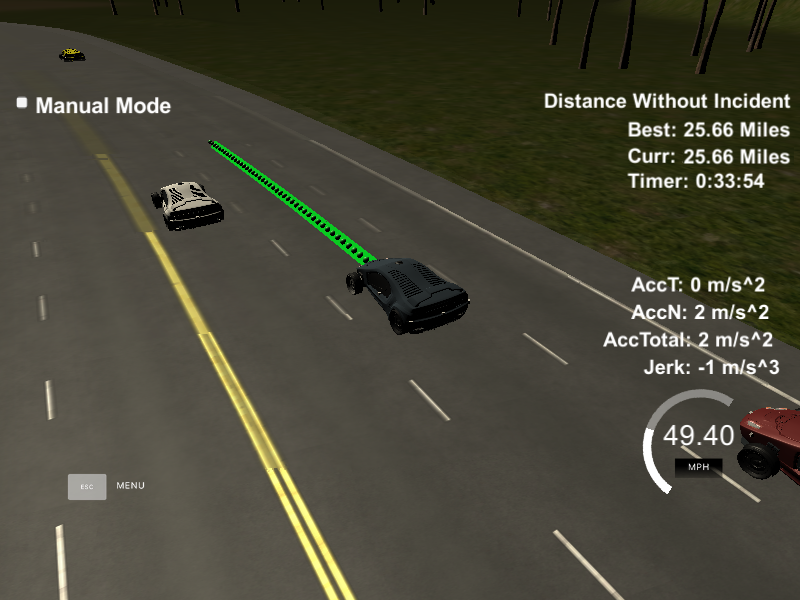

# CarND-Path-Planning-Project
Self-Driving Car Engineer Nanodegree Program

---
## Writeup file:
[Model Documentation pdf](ModelDocumentation.pdf)
   
### Simulator.
You can download the Term3 Simulator which contains the Path Planning Project from the [releases tab (https://github.com/udacity/self-driving-car-sim/releases/tag/T3_v1.2).

### Goals
In this project your goal is to safely navigate around a virtual highway with other traffic that is driving +-10 MPH of the 50 MPH speed limit. You will be provided the car's localization and sensor fusion data, there is also a sparse map list of waypoints around the highway. The car should try to go as close as possible to the 50 MPH speed limit, which means passing slower traffic when possible, note that other cars will try to change lanes too. The car should avoid hitting other cars at all cost as well as driving inside of the marked road lanes at all times, unless going from one lane to another. The car should be able to make one complete loop around the 6946m highway. Since the car is trying to go 50 MPH, it should take a little over 5 minutes to complete 1 loop. Also the car should not experience total acceleration over 10 m/s^2 and jerk that is greater than 10 m/s^3.

#### The map of the highway is in data/highway_map.txt
Each waypoint in the list contains  [x,y,s,dx,dy] values. x and y are the waypoint's map coordinate position, the s value is the distance along the road to get to that waypoint in meters, the dx and dy values define the unit normal vector pointing outward of the highway loop.

The highway's waypoints loop around so the frenet s value, distance along the road, goes from 0 to 6945.554.

## Basic Build Instructions

1. Clone this repo.
2. Make a build directory: `mkdir build && cd build`
3. Compile: `cmake .. && make`
4. Run it: `./path_planning`.

Here is the data provided from the Simulator to the C++ Program

#### Main car's localization Data (No Noise)

["x"] The car's x position in map coordinates

["y"] The car's y position in map coordinates

["s"] The car's s position in frenet coordinates

["d"] The car's d position in frenet coordinates

["yaw"] The car's yaw angle in the map

["speed"] The car's speed in MPH

#### Previous path data given to the Planner

//Note: Return the previous list but with processed points removed, can be a nice tool to show how far along
the path has processed since last time. 

["previous_path_x"] The previous list of x points previously given to the simulator

["previous_path_y"] The previous list of y points previously given to the simulator

#### Previous path's end s and d values 

["end_path_s"] The previous list's last point's frenet s value

["end_path_d"] The previous list's last point's frenet d value

#### Sensor Fusion Data, a list of all other car's attributes on the same side of the road. (No Noise)

["sensor_fusion"] A 2d vector of cars and then that car's [car's unique ID, car's x position in map coordinates, car's y position in map coordinates, car's x velocity in m/s, car's y velocity in m/s, car's s position in frenet coordinates, car's d position in frenet coordinates. 

## Details

1. The car uses a perfect controller and will visit every (x,y) point it recieves in the list every .02 seconds. The units for the (x,y) points are in meters and the spacing of the points determines the speed of the car. The vector going from a point to the next point in the list dictates the angle of the car. Acceleration both in the tangential and normal directions is measured along with the jerk, the rate of change of total Acceleration. The (x,y) point paths that the planner recieves should not have a total acceleration that goes over 10 m/s^2, also the jerk should not go over 50 m/s^3. (NOTE: As this is BETA, these requirements might change. Also currently jerk is over a .02 second interval, it would probably be better to average total acceleration over 1 second and measure jerk from that.

2. There will be some latency between the simulator running and the path planner returning a path, with optimized code usually its not very long maybe just 1-3 time steps. During this delay the simulator will continue using points that it was last given, because of this its a good idea to store the last points you have used so you can have a smooth transition. previous_path_x, and previous_path_y can be helpful for this transition since they show the last points given to the simulator controller with the processed points already removed. You would either return a path that extends this previous path or make sure to create a new path that has a smooth transition with this last path.

## Tips

A really helpful resource for doing this project and creating smooth trajectories was using http://kluge.in-chemnitz.de/opensource/spline/, the spline function is in a single hearder file is really easy to use.

---

## Dependencies

* cmake >= 3.5
  * All OSes: [click here for installation instructions](https://cmake.org/install/)
* make >= 4.1
  * Linux: make is installed by default on most Linux distros
  * Mac: [install Xcode command line tools to get make](https://developer.apple.com/xcode/features/)
  * Windows: [Click here for installation instructions](http://gnuwin32.sourceforge.net/packages/make.htm)
* gcc/g++ >= 5.4
  * Linux: gcc / g++ is installed by default on most Linux distros
  * Mac: same deal as make - [install Xcode command line tools]((https://developer.apple.com/xcode/features/)
  * Windows: recommend using [MinGW](http://www.mingw.org/)
* [uWebSockets](https://github.com/uWebSockets/uWebSockets)
  * Run either `install-mac.sh` or `install-ubuntu.sh`.
  * If you install from source, checkout to commit `e94b6e1`, i.e.
    ```
    git clone https://github.com/uWebSockets/uWebSockets 
    cd uWebSockets
    git checkout e94b6e1
    ```

## Editor Settings

We've purposefully kept editor configuration files out of this repo in order to
keep it as simple and environment agnostic as possible. However, we recommend
using the following settings:

* indent using spaces
* set tab width to 2 spaces (keeps the matrices in source code aligned)

## Code Style

Please (do your best to) stick to [Google's C++ style guide](https://google.github.io/styleguide/cppguide.html).

## Project Instructions and Rubric

Note: regardless of the changes you make, your project must be buildable using
cmake and make!


## Call for IDE Profiles Pull Requests

Help your fellow students!

We decided to create Makefiles with cmake to keep this project as platform
agnostic as possible. Similarly, we omitted IDE profiles in order to ensure
that students don't feel pressured to use one IDE or another.

However! I'd love to help people get up and running with their IDEs of choice.
If you've created a profile for an IDE that you think other students would
appreciate, we'd love to have you add the requisite profile files and
instructions to ide_profiles/. For example if you wanted to add a VS Code
profile, you'd add:

* /ide_profiles/vscode/.vscode
* /ide_profiles/vscode/README.md

The README should explain what the profile does, how to take advantage of it,
and how to install it.

Frankly, I've never been involved in a project with multiple IDE profiles
before. I believe the best way to handle this would be to keep them out of the
repo root to avoid clutter. My expectation is that most profiles will include
instructions to copy files to a new location to get picked up by the IDE, but
that's just a guess.

One last note here: regardless of the IDE used, every submitted project must
still be compilable with cmake and make./

## How to write a README
A well written README file can enhance your project and portfolio.  Develop your abilities to create professional README files by completing [this free course](https://www.udacity.com/course/writing-readmes--ud777).

 
### Objective

The objective of this project is to run the car in simulator to follow lane lines and to not collide with other cars. Also to switch the lanes safely if there is a slow moving vehicle ahead of our car.

### Rubric Points

**Compilation:** The code compiles correctly.
I used spline.h library and added in the source folder. The code compiled without any errors.

### Valid trajectories

**Description:** The car is able to drive at least 4.32 miles without incident.	
**Result:** Car drove more than 25 miles without any incident

**Description:** The car drives according to the speed limit.	
**Result:** Car never crossed the speed limit

**Description:** Max Acceleration and Jerk are not Exceeded.	
**Result:** Within given limit

**Description:** Car does not have collisions.	
**Result:** No collisions

**Description:** The car stays in its lane, except for the time between changing lanes.	
**Result:** Car stays in the lane

**Description:** The car is able to change lanes	
**Result:** Car successfully changed lanes when it’s safe to change lane.


 

Screenshot of the successfull run

### Reflection
**Model description:**

The main.cpp file listens to the message sent from the simulator (using web sockets). The simulator sends the data related to car, like Car’s location, velocity, yaw rate, speed and Frenet coordinates (longitudinal and lateral displacement). It also sends the data from the sensor fusion which contains data for other cars in vicinity.

The working of the model can be broken down in following three parts:

**1. Prediction**
The data from the sensor fusion and simulator is used to generate the predictions about the likely behavior of moving objects. Like if there is a car in front of us, what it will do in future and based on that we will decide the behavior of our car. Also this data will be used to detect the cars in the adjacent lanes and make maneuver decisions in next step.

**2. Behavior Planning**

Based on the prediction of the other moving objects we decide the behavior of our car. There can be following behaviors which our car can do based on the other moving cars:

**Prediction	Behavior of our car**

**1. Car ahead us is too close:**	Slow down our car

**2. Car ahead us is driving slow:**	See if we can change lane safely

**3. Both left and right lanes are safe to change lane:**	Change lane which has longer free run before a car appears.

**4. Car ahead us is slow and there is another car in left lane:**	Change the lane to right (but see first if it is safe to change the lane and we are not in the right most lane)

**5. Car ahead us is slow and there is another car in right lane;**	Change the lane to left (but see first if it is safe to change the lane and we are not in the left most lane)

**6. There is no car ahead of us or car is too far away:**	Increase the speed of the car to approx. speed limit and maintain the lane

The buffer distance between our car and car ahead is set as *25 meters*.

We try to change the lane if there is no vehicle in the side lane in front of us for 25 meters and there is no car too close to us(approx. 5 meters) which is coming from behind (there might be a car coming too fast from side lanes while we plan to change the lane).

**Trajectory Generation**

The car calculates the trajectory based on the speed, other vehicles position - velocity and current lane, car coordinates and past path points. To make the trajectory smooth we addthe last two points from the previous trajectory path. If there are no previous paths we calculate the previous point from the current yaw rate and the current car coordinates. 

Also we add three way points in next 30 meters, 60 meters and 90 meters to the trajectory. All these points are then shifted to the car reference angle (local car coordinates) – this is done to simplify the calculations.

We then use spline library to get the remaining points of the trajectory based on the current path (we are adding total of 50 points to the trajectory). All these points are then again moved to the global coordinates (so that these can be sent to the simulator to generate the trajectory and to drive the car based on this trajectory)

### Conclusion
This project helps us to visualize the Path planning and helps us to understand why it is one of the most crucial parts of the autonomous vehicle. Safety is one of the most important point in the path planning.


